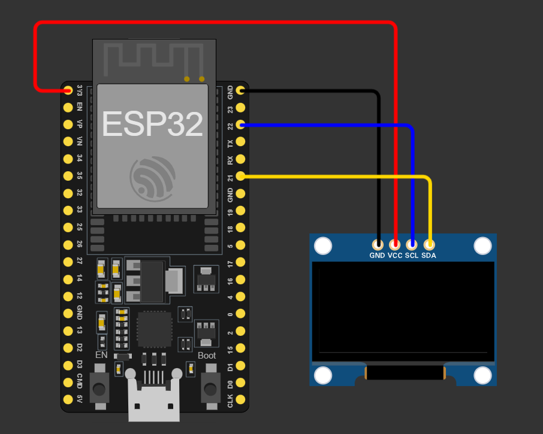

# Weather Station
 Recive Weather information from internet using API

 
 

 

 

 

# components:
* ESP32-WROOM-32D (Espressif32 ESP32 Dev Module)
* I2C Oled Display 128*64
* Some jumper wires

# Connections
* Gnd --> Gnd 
* Vcc --> 3.3
* Sck/Scl --> GPI/O 22 (Default SCL pin)
* SDA --> GPI/O 21 (Default SDA pin)
* you can use any pin but you have to define these pins (look for proper tutorial for this)

# Make some changes in the Code
you have to change these lines:

`const char* ssid = "Your-SSID-Here";`

`const char* password = "Your-WIFI-Password-Here";`

`String URL = "https://api.open-meteo.com/v1/forecast?latitude=*********&longitude=*********&current=temperature_2m,relative_humidity_2m,wind_speed_10m,weather_code,apparent_temperature&timezone=auto";`

* Replace *** (stars) with your location Credentials
* you can get a custom link from [here](https://open-meteo.com/)

# Don't Forget to install libraries
for more information check the [platformio.ini](./platformio.ini) file.

# Give it a Star!
I'll be greatefull if you give this project a star⭐.

